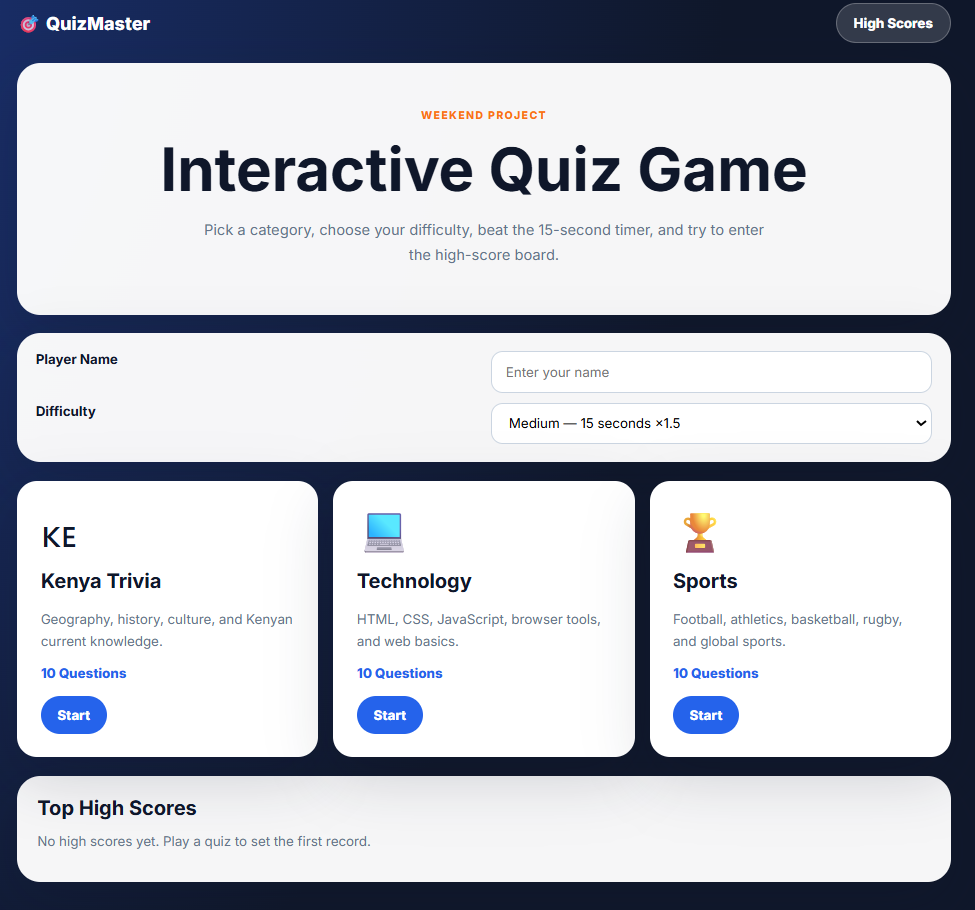
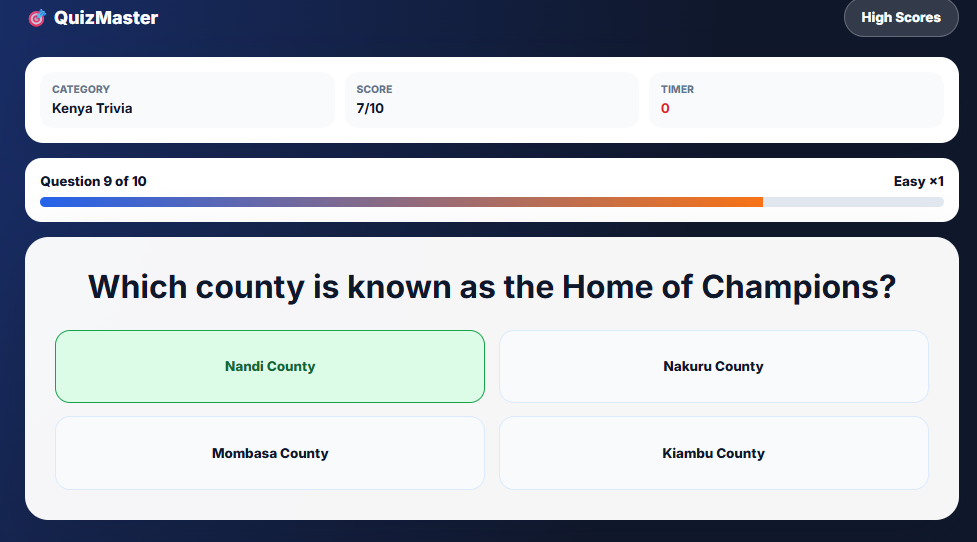
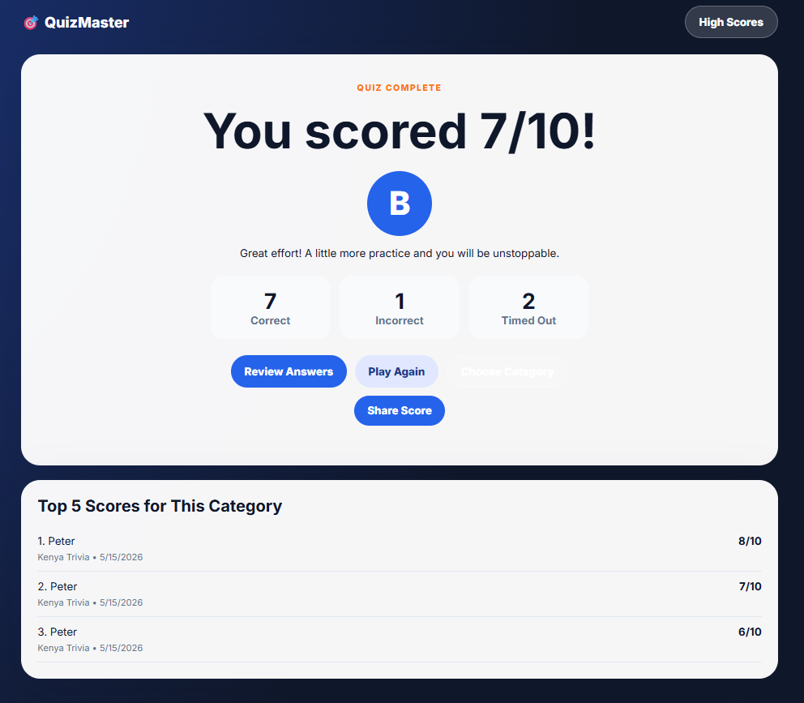
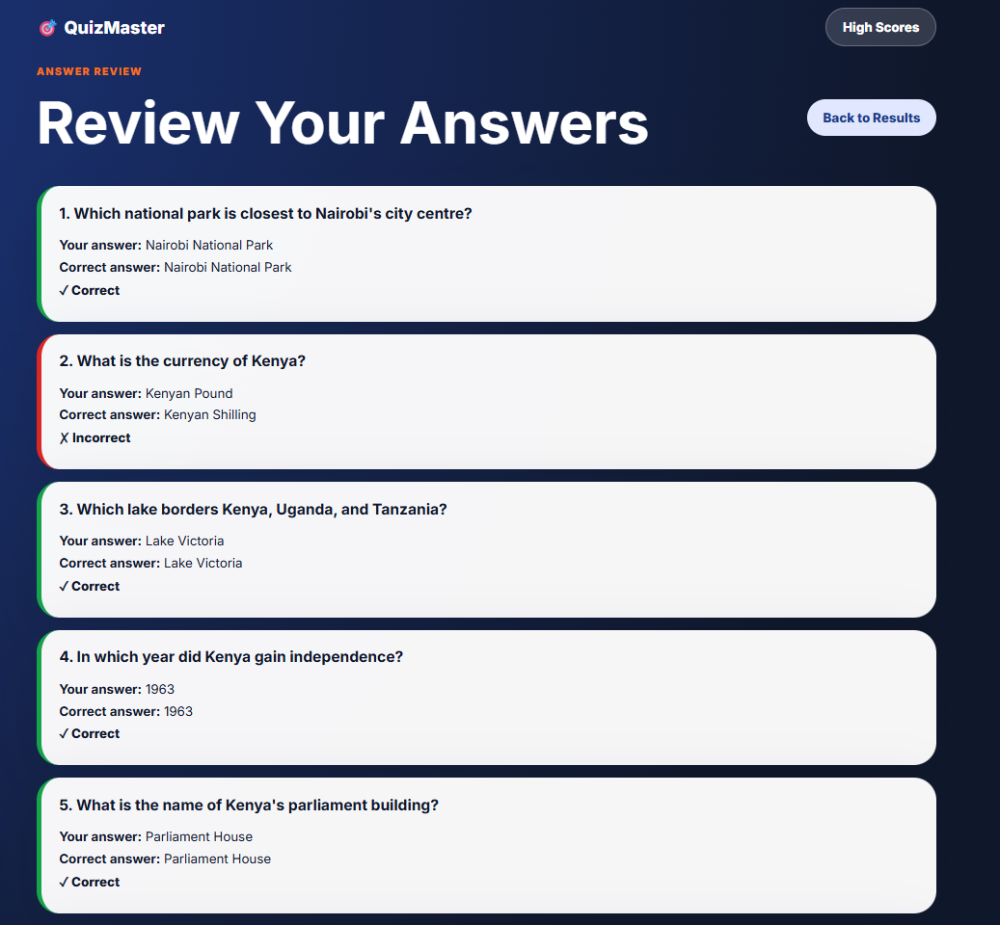
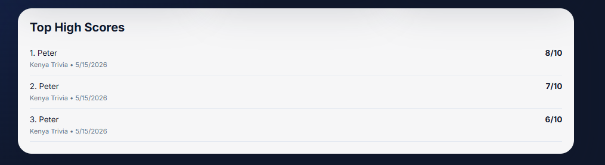

# Week 2 Weekend Project: QuizMaster Interactive Quiz Game

QuizMaster is a responsive browser-based quiz game built with HTML, CSS, and vanilla JavaScript.

## Features

- Category selection screen with Kenya Trivia, Technology, and Sports
- 10 questions per category, 30 questions total
- 15-second medium timer, plus easy and hard difficulty options
- Correct and wrong answer feedback
- Progress bar and running score
- Results screen with grade and performance message
- Review mode showing user answers and correct answers
- High score board stored in localStorage
- Randomized question order
- Share score button
- Responsive design for desktop and mobile

## Tech Stack

- HTML5
- CSS3
- Vanilla JavaScript
- localStorage
- GitHub Pages

## File Structure

```text
week-2-quiz-game/
├── index.html
├── css/
│   └── styles.css
├── js/
│   ├── app.js
│   └── questions.js
└── README.md
```

## How to Run Locally

1. Open the folder in VS Code.
2. Open `index.html`.
3. Right-click and select **Open with Live Server**.

## Live URL

Add your GitHub Pages link here after deployment.

## Screenshots

### Home / Category Selection



### Quiz Gameplay



### Results Screen



### Answer Review



### High Scores

